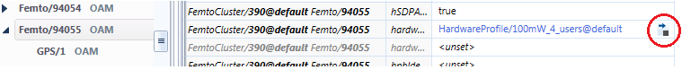
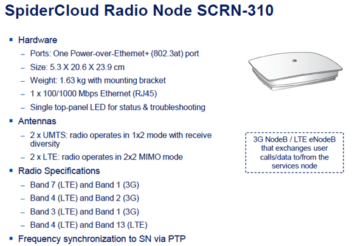

INDOOR Y NUEVAS TECNOLOGÍAS 
===========================

Optimizar las soluciones Indoor y nuevas tecnologías de red de acceso, analizando el impacto de la implementación de cada una y corroborar que se cumpla con los estándares de calidad durante todo el proceso.

1.	DOCUMENTACIÓN DAS 
---------------------

1.2. COMBA
**********

.. _Training_CLAR_AR:  ../_static/images/das/Training_CLAR_AR.pptx
.. _Troubleshooting_DAS: ../_static/images/das/Troubleshooting_DAS.pptx
.. _Argentina_CMS_Training_ESP: ../_static/images/das/Argentina_CMS_Training_ESP.pptx
.. _integracion_desde_OMT_DAS: ../_static/images/das/integracion_desde_OMT_DAS.pptx
.. _DAS_v6: ../_static/images/das/DAS_v6.pdf

+	**Introducción DAS** : Entrenamiento básico de DAS: arquitectura, como funciona, modelos de HW, especificaciones técnicas, etc.
	Ver Link: Training_CLAR_AR_
 
+	**Troubleshooting DAS** : Contiene un listado sobre principales alarmas que reportan los sistemas DAS, sus posibles causas y soluciones.
	Ver Link: Troubleshooting_DAS_
 
+	**Sistema de Gestión DAS COMBA**: Incluye principios de funcionamiento del CMS que es el sistema de gestión de los DAS Comba (Información general, 		   Estructura IP, de HW y Rutinas de Mantenimiento).Ver Link : Argentina_CMS_Training_ESP_

+	**Integracion en sitio**: Explicación para conectarse localmente al DAS, a través del OMT (integración de un sitio nuevo, configuración, 					parametrización, etc)

	+	**POR GPRS** Ver Link: integracion_desde_OMT_DAS_

	+	**POR ETH** Ver link: DAS_v6_

1.3. COMMSCOPE
**************

.. _ION_U_ION_E_Product_Overview_AUG_2016: ../_static/images/commscope/ION_U_ION_E_Product_Overview_AUG_2016.pdf

.. _AIMOS_V2: ../_static/images/commscope/AIMOS_V2.pdf

·  Presentación de producto ION-U/ ION-E. 
	Ver link ION_U_ION_E_Product_Overview_AUG_2016_

·  Introducción al gestor del DAS Aimos. 
	Ver link AIMOS_V2_

2. FEMTO CELL
-------------

.. _descarga: ../_static/images/FEMTO/waterfox.exe

.. raw:: html 

	
<strong>CONSIDERACIONES GENERALES</strong>

Debido a que las herramientas necesarias para la gestión de FEMTO son varias y requieren distintas versiones de JAVA (que muchas veces no son compatibles con el resto de las herramientas que utilizamos), se instalaron todas en el Servidor SGD3. Por esto antes de comenzar con la gestión de las FC, se deben solicitar los accesos correspondientes:

•	SGD3 (user y pass de red pero debe tener permisos)
•	Acceso al WMS [1]_
•	Acceso de **escritura y lectura** al SFTP 10.105.109.28
•	Acceso al HDM 
•	Acceso al NPO de Femto Cell

.. [1] : este mismo usuario se utilizará para ingresar al Putty y al servidor (10.105.109.28),en donde se almacenan los Snapshots. 

	Para SGD se debe solicitar el acceso a través de TR en la ruta:

	OPERACIONES --> CTROL.GESTION.ADMIN --> SOPORTE APLICACIONES --> USUARIO DCN

	Para el resto de las herramientas de ALU se debe solicitar vía mail a Damian Pizzini/ Ricardo Bandini.

.. raw:: html 

     

  <table border="1">
  

  <td>

  	Para no tener problemas con el SGD, ya que éste también utiliza Java se sugiere:

  <ul>

  	<li>Ejecutarlo a través del navegador WaterxFox (familia Mozilla, link <a href="../_static/images/FEMTO/WaterfoxPortable_52.0.1_English.paf.exe">descarga</a>)</li>

    <li>Se recomiendan los java 8 y 6 para el correcto funcionamiento. Se deben tener instaladas las versiones para 32 y para 64 bits (para descargar link <a href="http://storage01.oss.ar.telmex/java/">http://storage01.oss.ar.telmex/java/</a>) ). Para esto verificar que exista la carpeta Java dentro de C:\Archivos de programa y C:\Archivo de programa (x86).</li>

    <li>De fallar al momento de cargar alguna de las aplicaciones, intentar también desde el  link <a href="https://sgd04.oss.ar.telmex/sgd">https://sgd04.oss.ar.telmex/sgd</a>)</li>

    <li>Chequear dentro de la consola de Java (Panel de Control - > Java), en la pestaña Avanzado dentro de la opción Java Predeterminado para Navegadores debe estar tildada la opción Familia Mozilla.</li>

    <li>Se debe agregar el link de SGD al listado de excepciones de sitios de Java (Panel de Control -> Java -> Seguridad -> Editar lista de sitios</li>

  </ul>
  </td>
  </table> 

La configuración de toda la red ALU se baja diariamente en un archivo (Snapshot) que es el equivalente a un “Dump” desde el Netact y se sube al servidor SFTP. Este archivo se maneja con el WPS que es el SW de gestión de ALU (Equivalente al CM Editor del Netact). Esta herramienta sirve para revisar la parametrización de las distintas FEMTOs, como por ejemplo los Profiles que son sets de parámetros que se agrupan dentro de una categoría:

•	Hardware Profile: agrupa los parámetros de potencia (CPICH, max power limit, etc)
•	Location Profile: agrupa parámetros de RF (UARFCN, frequency BAND, etc)
•	Profile: agrupa parámetros de HO (QRxLevmin, QQualmin, etc)

**Al momento de revisar una FEMTO se debe tener el último Snapshot para tener la configuración actualizada.**

.. _FileZilla_setup: ../_static/images/FEMTO/FileZilla_setup.exe

.. raw:: html

	
<strong>REVISAR CONFIGURACION DE FEMTO</strong>

1.	Para poder conectarse al SFTP 10.105.109.28 se debe utilizar un gestor como Filezilla. El usuario y password se gestiona con Damian Pizzini/ Ricardo Bandini (ES EL MISMO QUE SE UTILIZA PARA WMS, PRIMERO SE DEBE INGRESAR AL WMS, EN EL PRIMER INGRESO PIDE CAMBIAR LA CLAVE Y UNA VEZ QUE ESTE USUARIO ESTE GENERADO Y YA SE HAYA INGRESADO AL WMS, SE PUEDE UTILIZAR EN EL FTP)

2.	Ingresar en la ruta /opt/nortel/data/cmXML/scheduledExport y buscar el último snapshot del día “UTRAN-SNAP20170116xxxxxx.xml” y guardarlo en el disco compartido \\corpsaba-usr\share\Engineer\Calidad\Biblioteca\Indoor y nuevas tecnologias\FEMTO\SNAPSHOT_WO\ 

3.	Ingresar al ALU WPS Femto 4.1.14.2 desde el SGD3 https://sgd03.oss.ar.telmex/sgd con usuario y password de red.

4.	Abrir el snapshot File-> Open->Snapshot.

.. image:: ../_static/images/FEMTO/pag2.2.png
  :align: center

5.	Dentro de FemtoCluster/390@default se encuentran las Femtos de Argentina y se dividen en 2 grupos Femto/xx y FemtoGroup/xx, según tengan uno o más sectores. Si se conoce el Cell id se busca en Filter On por texto Femto/cellid o FemtoGroup/cellid:

.. image:: ../_static/images/FEMTO/pag3.png
  :align: center

Si no se conoce el Cell id y se tiene el cell name, seleccionamos todas las Femtos y vamos a la pestaña Tabular Editor y en la columna bSRName filtramos por el nombre de la FC.

.. image:: ../_static/images/FEMTO/pag3.2.png
  :align: center

En caso de ser un Femto Group, seleccionamos y en Tabular Editor filtramos sobre el campo GroupName el nombre de la FC.

6.	Para revisar los profiles asignados a cada FEMTO, nos posicionamos en la FC, en la pestaña Object Editor y hacemos click en la flecha del profile para ver los parámetros del mismo: 

La versión que está en vigencia es la 4.1.14.2 por lo que de existir más de un profile, se debe tener en cuenta el 14_02_00

.. image:: ../_static/images/FEMTO/pag4.png
  :align: center

**(Los parámetros más importantes del Profile, Hardware Profile y Location Profile se encuentran dentro de Lcell)**

.. raw:: html 

	
<strong>IMPORTANTE: LOS PARAMETROS AGRUPADOS EN CADA PROFILE SE APLICAN A MAS DE UNA FC POR LO QUE SI SE QUIERE CAMBIAR ALGUN VALOR SE DEBE GENERAR UN NUEVO PROFILE PRIMERO Y LUEGO ASIGNARLO A LA FC</strong>

	
	
<strong>REALIZAR CAMBIOS EN FEMTO</strong>

1.	Para realizar un cambio de parámetros, nos posicionamos en el valor del mismo, hacemos doble click y ponemos el nuevo valor.
2.	Para realizar un cambio de Profile, hacemos doble click y se habilita el listado de los distintos Profiles existentes (se deben revisar los parámetros que tiene cada uno de los Profiles de antemano para saber cuál es el nombre del que vamos a asignar)
3.	Luego se deben guardar los cambios en una Workorder. Para esto, una vez que realizamos los cambios vamos a la pestaña Workorder; hacemos click derecho sobre new workorder y seleccionamos la opción Save workorder On local file system.  (Se recomienda que el nombre del archivo tenga la acción que se llevará a cabo en esta WO y la celda en la que se realizará el cambio, por ej: ChangeLocationProfile_BA509) y lo guardamos en el disco compartido \\corpsaba-usr\share\Engineer\Calidad\Biblioteca\Indoor y nuevas tecnologias\FEMTO\SNAPSHOT_WO\

.. image:: ../_static/images/FEMTO/pag5.png
  :align: center

4.	La WO consta de 2 archivos XXXXX-default.xwo y XXXXX -default_reverse.xwo. El primero contiene los cambios propiamente dichos y el segundo “deshace” estos cambios, por lo que es importante subir ambos archivos .xwo al servidor para ejecutarlos con el WMS ya que si fallaran los cambios se puede volver atrás ejecutando el –default_reverse.xwo. La ruta en donde deben subirse los archivos es Opt/Data/Nortel/CM XML/

.. raw:: html 

	
<strong>EJECUTAR UNA WO EN EL WMS</strong>

1.	Ingresar al WMS a través del SGD https://sgd03.oss.ar.telmex/sgd con usuario y pass de red en el primer logueo para acceder a la máquina virtual y luego para acceder al ALU 9353 WMS Femto con el usuario de WMS. IMPORTANTE: si solicita actualizar la versión de Java presionar la opción “Mas tarde”.
2.	Ingresar a Configuration -> Session Manager y Create new session, aqui también es aconsejable que el nombre de la sesión lleve el nombre de la celda a modificar y que tipo de cambio se va a ejecutar. Una vez creado el nombre, seleccionamos la WO, presionamos Add to list y luego Next. En la siguiente ventana, click en Launch.
IMPORTANTE: una vez que terminó de correr la WO, se debe cerrar la sesión en el listado de Session Tasks -> Terminate session.

.. raw:: html 

	
<strong>DESCARGAR UN SNAPSHOT ACTUAL</strong>

El Snapshot con la configuración de toda la red de ALU se puede descargar manualmente, por ejemplo si se quiere verificar que hayan impactado los cambios realizados. Para esto, en el WMS, vamos a Configuration -> CM XML -> Export Network. Seleccionamos UTRAN y tildamos la opción Compressed para que genere un .zip. En Directory dejamos la ruta que figura por defecto /cmXML/manualSnapshot; cargamos un nombre en File y luego click en Export now. El archivo .zip se guardará dentro del servidor de ALU por lo que hay que volver a conectarse por Filezilla al 10.105.109.28 Opt/Data/Nortel/cmXML/manualSnapshot.

.. raw:: html 

	
<strong>CONECTARSE A UNA FEMTO</strong>

1.	A través de Putty conectarse al servidor 10.105.109.28 (SSH, puerto 22). El usuario y password para ingresar es el mismo que se utiliza para el WMS. Tipear bsrsorted  |grep XXXXX (Se deben ingresar los primeros 5 caracteres del cell name, por ejemplo X4024). Este comando nos mostrará las IP que tiene asignado para el túnel cada una de las FC. Copiar los últimos 2 octetos de la IP de la FC a la que nos vamos a conectar y tipear femto14 xxx.xxx

Si la FC tiene túnel, es decir si funciona la tx d la FC, deberíamos tener el prompt “root@femto-xxxxxxxxxx:~#” como se muestra a continuación:

Si la FC no tiene túnel, entonces quedará intentando conectar por unos segundos hasta que da timeout, como en el ejemplo: 

2.	Una vez conectado a la FC, tipeamos console y luego menu. A continuación aparece un listado de comandos que se pueden consultar como por ejemplo:

+ Radio encendido

Ingresamos en la FC, tipeamos console y luego radioStatus. Con este comando podemos ver si el radio está habilitado, la banda en la que está la FC y la máxima potencia de tx:

.. image:: ../_static/images/FEMTO/pag14.png
  :align: center

+ Chequeo de adyacencias

Dentro de Menu, seleccionamos las opciones 13 (Macro Neighbour Menu ) y luego luego 1 (Dislplay Internal Handover Statistics (BRRM)), estos 2 comandos nos muestran las celdas macro que la FC está sniffeando con su HO attempts y HO successes.

.. image:: ../_static/images/FEMTO/adyacencia.png
  :align: center

+ Chequeo CPICH

Dentro de Menu seleccionamos las opciones 10 (CELL Menu); 4 (Get Cell data BRRM) y luego la opción 1 (Get current Pilot Primary CPICH Power).

.. image:: ../_static/images/FEMTO/pag15.png
  :align: center

+ Status LEDs operativos

Dentro de Menu, seleccionamos opción 7 (Status Check) y luego opción 2 (Ue Context Allocated). Esto nos da la información del estado operativo de la FC

.. image:: ../_static/images/FEMTO/pag16.png
  :align: center

El LED de Phone, nos indica las llamadas cursadas por la FC:

- OFF: no hay llamadas de voz activas
- ON: por lo menos 1 llamada en curso.
- FLASH (intermitente): la FC está cursando el máximo de llamadas permitidas.

El LED System, nos indica la disponibilidad de la FC:

- OFF: no se encuentra disponible
- ON: lista para proveer servicio
- FLASH (intermitente): el sistema está inicializando

.. raw:: html 

	
<strong>ENCENDER O APAGAR EL RADIO DE UNA FEMTO</strong>

1.	A través del SGD ingresamos al HDM; https://sgd03.oss.ar.telmex/sgd con usuario y pass de red en el primer logueo para acceder a la máquina virtual y luego para acceder al ALU HDM Femto con el usuario de HDM. **IMPORTANTE**: si solicita actualizar la versión de Java presionar la opción “Mas tarde”. El usuario y pass para el HDM también se solicita por mail a Damian Pizzini/ Ricardo Bandini 

.. image:: ../_static/images/FEMTO/pag7.png
  :align: center

2.	Vamos a la primera opción de Devices Manage Devices. Para buscar una FC seleccionamos en Search Profile la opción Find Small Cell Devices By Service Tag, en Service Tag Name escribimos cellid y en Service Tag Value ponemos la FC que queremos (si es un grupo de celdas no le ponemos el sector A, B, etc)

3.	Clickeamos el botón Manage y en Queued Functions seleccionamos la pestaña Queue Action, luego en Action se encuentra un listado de comandos como por ejemplo activar o desactivar el radio. Elegimos y clickeamos el botón Queue.

.. image:: ../_static/images/FEMTO/pag8.png
  :align: center

.. raw:: html 

	
<strong>REINICIAR UNA FEMTO</strong>

Clickeamos el botón Manage y en Queued Functions seleccionamos la pestaña Queue Function, luego en Function seleccionamos la opción Reboot y clickeamos el botón Queue.

.. image:: ../_static/images/FEMTO/pag8.png
  :align: center

2.1. Guia para Aceptacion
**************

**DOCUMENTACIÓN A CONTROLAR**

La documentación de aceptación está almacenada en Ledzite y en el Sharepoint de Calidad http://colaboracion.claro.amx/sites/gciacalidadred/relevamientoymedicionesbda/_layouts/15/start.aspx#/Lists/Smallcell/AllItems.aspx (de no contar con este acceso se debe solicitar al grupo Care Calidad).
Al recibir la aceptación se debe buscar tanto en Ledzite como en el sharepoint, y bajar la última versión de los siguientes documentos:

-	XX_Diseño.ibw: contiene el archivo de diseño para abrir en IBwave.
-	XX_TSS_PRE.pdf: contiene el relevamiento que realiza ALU con características del edificio y mediciones con Qualipoc para poder comenzar el diseño.
-	XX_RF_Sheet.xlsx: contiene la parametrización con la que se diseña e implementa la solución (Profiles, PSC, Cellid, vecinas, etc).
-	XX_Diseño.pdf: contiene la solución que se va a instalar, hojas de datos, predicciones de IBwave (RSCP, ECIO), etc. 
-	CAO_XX.pdf: este es el Conforme a Obra, tiene la descripción de lo que quedó instalado realmente y la conformidad del cliente.
-	XX_TSS_POST. Pdf*: contiene el walktest  y los resultados de las pruebas que se realizan una vez concluida la instalación. Ésta sería la auditoría final una vez que finalizó la obra.

*Si es una HC, puede que no tenga medición posterior a la instalación. Esto deberá consultarse con el grupo Care Calidad.

Esta documentación debe controlarse tal como se hace con la red Macro. Verificar que lo instalado coincida con lo diseñado; que de existir alguna modificación en la instalación física o en la parametrización, ésto quede aclarado en la documentación correspondiente. Dentro del documento POST hay un resumen de configuración que debe coincidir con la RF Sheet (de no ser así se debe verificar si contamos con la última versión de RF Sheet)

**PARÁMETROS A CONTROLAR CON RF SHEET (CORE ALU VS CORE CLARO)**

Se debe verificar que la parametrización de la FC sea según lo diseñado en la RF Sheet. Para esto es necesario contrastar los parámetros en el WPS en un snapshot actualizado (consultar la sección REVISAR CONFIGURACION DE FEMTO en la wiki de optimización) ya que los valores que figuran en el CME son solamente del elemento virtual y no los que realmente tiene configurado la FC:

-	UARFCN
-	Cellid
-	Gateway/no Gateway
-	PSC
-	LAC/RAC

Perfiles 

Se debe corroborar que la FC tenga asignado los perfiles de diseño (RF_Sheet):

-	Hardware Profile: agrupa parámetros de potencia
-	Location Profile: agrupa parámetros de RF
-	Profile: agrupa parámetros de movilidad*

*Dentro de este Profile se especifica en el mismo campo si la FC es Gateway o no. Por convención, solo se aclara cuando no son GW, por ej Profile/4216_Metro_Indoor_F2FHO_no_GW@default.

Algunos Profiles, tienen más de una carpeta BSRProfile; cada una de estas carpetas contiene agrupados los parámetros para distintas versiones de WPS. Al día de hoy debemos corroborar los parámetros dentro de la versión 14_02_00.

**KPIS**

Los kpis a controlar se deben consultar en IBWH para tener en cuenta los 5 días con más tráfico de la FC. Bajar el Excel desde SMART, ACCESO -> FEMTOCELL -> CELL -> REPORTE AREA OPTIMIZACION

- Accesibilidad de Voz /Datos: debe superar el 90%

- Drop Voz /Datos: debe ser menor al 2%

- Disponibilidad: debe ser mayor al 95%

- Handover SR: debe ser mayor al 90%

- Interferencia en Uplink -65 dbm

Se deben verificar también los eventos de Congestión de BH. Si el mismo es de Claro, se puede rechazar el sitio, de lo contrario se comentará esta situación en el TR.

**INTEGRACIÓN DE FEMTO EN NETACT**

-	Verificar que el elemento esté creado en Netact (con la nomenclatura nueva). 
-	Verificar que tenga cargadas las adyacencias que figuran en la RF Sheet 

Se debe hacer una nueva optimización de adyacencias, para esto se debe ingresar a la Femto por Putty (consultar la sección Conectarse a una FEMTO de la wiki de optimización, las opciones dentro de menú son 13 y 1) para ver si la FC está scaneando nuevas celdas macro. En caso de encontrar alguna nueva adyacencia que no esté creada se debe agregar en el CME. Para esto seleccionamos la FC y el sector de la macro y con botón derecho y seleccionar la opción Create Unidirectional Adjacency to Network. El HOPS/HOPI que se utiliza para las soluciones indoor es el 74 - FEMTO.

**WALKTEST**

Dentro del archivo XX_TSS_POST. Pdf, está la medición final con la FC ya instalada. Se debe verificar que se cumpla con los objetivos de diseño. Por ejemplo si en la ingeniería (archivo XX_TSS_PRE.pdf) se especifica que se va a dar cobertura al área de administración, verificar que los valores de RSCP e ECIO sean buenos sobre todo en dicha área.

Dentro del archivo de Walktest están las pruebas de re selección y de HO, se deben revisar las mismas y corroborar que el cuadro que posee las pruebas de llamadas, HO y re selección este todo OK.

En la comparación entre lo medido y lo diseñado (predicción IBwave), se tolerara un margen de desviación de hasta un 5%. Ej.: si tenemos en la predicción una zona en la que el RSCP esperado es de -100 dbm, los niveles medidos en esa zona en el WT no deberían ser inferiores a -105 dbm.

3. SPIDERCLOUD
-------------

.. raw:: html 

	
<strong>Introducción</strong>

La solución de Small Cells SpiderCloud se puede diferenciar en dos partes, la parte de acceso RAN (E-RAN) y la parte de Core virtualizada (vHetNet). Si bien en la sección documentos hay información sobre vHetNet, la información en la Wiki está orientada a RAN.

.. raw:: html 

	
<strong>Arquitectura, Componentes y HW</strong>

Los elementos principales que componen la E-RAN son los Radio Nodos (RN) y los Nodos de Servicio o Services Nodes (SN). 

El SN posee funciones similares a la de una RNC. Gestiona la movilidad y Soft HO entre RNs, interferencia y funcionalidades de SON. Provee el único punto de integración con el core mediante un túnel IPSec al Security Gateway (elemento de acceso al core). 

Los RN contienen las celdas específicas de UMTS y LTE en una sola unidad física. Estos se conectan al SN mediante cable UTP y se alimentan por PoE. Poseen dos antenas internas o dos puertos para conectar antenas externas con una potencia máxima de salida total de 250 mW. Por lo que para funcionalidad MIMO la potencia se reduce a la mitad.

A continuación se listan algunas capacidades relacionadas con los componentes del sistema.

.. image:: ../_static/images/spidercloud/image3.png
  :align: center

.. image:: ../_static/images/spidercloud/image5.png
  :align: center

.. _SCT_120_ClaroAR: ../_static/images/spidercloud/SCT_120_ClaroAR.pdf

.. _SCT_220_ClaroAR: ../_static/images/spidercloud/SCT_220_ClaroAR.pdf

.. _SCOS_Data_Model-Reference_R5.1: ../_static/images/spidercloud/SCOS_Data_Model-Reference_R5.1.pdf

.. _SCOS_CLI_Guide_R5.1: ../_static/images/spidercloud/SCOS_CLI_Guide_R5.1.pdf

.. _KPISSPIDERCLOUDCiscoSerie8000: ../_static/images/spidercloud/KPI'SSPIDERCLOUDCiscoSerie8000.xlsx

.. _CiscoUSC8000OSAdminGuideRelease4.1: ../_static/images/spidercloud/CiscoUSC8000OSAdminGuideRelease4.1.pdf

.. _Cisco_USC_8K_Top_Alarms_V2: ../_static/images/spidercloud/Cisco_USC_8K_Top_Alarms_V2.ppt

.. _CentralizedServicesNode2017Argentina: ../_static/images/spidercloud/CentralizedServicesNode2017Argentina.pptx

.. _Claro-AR_SCS4.1_vHetNet_Training: ../_static/images/spidercloud/Claro-AR_SCS4.1_vHetNet_Training.pdf

.. raw:: html 

	
<strong>Documentacion</strong>

•	**Introducción SpiderCloud**: Entrenamiento básico: arquitectura, HW y funcionamiento, especificaciones técnicas, SON, seguridad, gestión, alarmas, KPIs, etc. Ver Link : SCT_120_ClaroAR_ 
•	**SpiderCloud Deployment**: Descripción del proceso de deployment, relevamiento, diseño, planning, procedimiento de instalación y troubleshooting. Ver Link: SCT_220_ClaroAR_
•	**Guia de Parametros**: Contiene descripción de cada parámetro, tipo de parámetro, si es o no configurable, valor por default. Ver Link: SCOS_Data_Model-Reference_R5.1_
•	**Manual de Comandos**: Guía de usuario para el uso de comandos (CLI) en el Services Node. Estructura, sintaxis, comandos para modo “configuration” y “Operational mode”. Ver Link : SCOS_CLI_Guide_R5.1_
•	**KPIs**: Indicadores de Red, fórmulas y contadores para la evaluación de Performance. Ver Link: KPISSPIDERCLOUDCiscoSerie8000_
•	**Guia de Administrador**: Manual para administrar el SN (por CLI) en donde se indican procedimientos para cambios de parámetros y configuraciones con ejemplos. Ver Link: CiscoUSC8000OSAdminGuideRelease4.1_
•	**TOP Alarm en Spidernet**: Descripción de Alarmas principales y como proceder en cada caso. Ver Link: Cisco_USC_8K_Top_Alarms_V2_
•	**Modo Centralizado**: Descripción del modo centralizado, requisitos, provisionamiento, diagrama de conexión. Ver Link : CentralizedServicesNode2017Argentina_  
•	**Core vHetNet**: Arquitectura, descripción y funcionamiento de componentes e interfaces, integración en claro, troubleshooting. Ver Link : Claro-AR_SCS4.1_vHetNet_Training_

.. raw:: html 
	
	
<strong>Verificaciones para Truobleshooting y cambios de configuración</strong>

	
	
<strong>Conectarse por SSH a un SN desde Spidernet</strong>

Al hacer click derecho sobre el SN del sitio podemos usar la opción Open SSH para conectarnos al SN por CLI. Usuario y password: admin

.. image:: ../_static/images/spidercloud/image6.png
  :align: center

.. image:: ../_static/images/spidercloud/image7.png
  :align: center

.. raw:: html 

	
<strong>Comprobar conectividad con el SN desde Spidernet</strong>

Al hacer click derecho sobre el SN del sitio podemos usar la primera opción del menú desplegable (ICMP Ping)) para verificar la conectividad con el SN.

.. raw:: html 

	
<strong>Ver alarmas en el SN (CLI)</strong>

“Show system alarm” (para alarmas activas).

“Show system alarm history” (para alarmas históricas).

.. raw:: html 

	
<strong>Conectividad con el Core</strong>

Con el comando “Show core” podemos verificar si el túnel IPsec con en SecGW está arriba (established). 

También se puede ver el estado de las conexiones 3G con el Iuh GW y la 4G contra el S1 Gateway (ambas deben estar connected).

.. image:: ../_static/images/spidercloud/image10.png
  :align: center

.. raw:: html 

	
<strong>Status de ServicesNode</strong>

“Show ServicesNode”

El estado operativo debe ser IS-NORMAL “In Service - normal”

.. raw:: html 

	
<strong>Status de los Radionodos</strong>

“Show Radionode”

El estado operativo debe ser IS-NORMAL “In Service - Normal”

.. image:: ../_static/images/spidercloud/image12.png
  :align: center

.. raw:: html 

	
<strong>Verificar sesiones activas</strong>

Se pueden verificar sesiones activas por Tecnología, listando IMSI, estado RRC, Celda asociada, tipo y causa de sesión, etc.

Se utilizan los comandos “Show sesión UMTS” o bien “Show session LTE”

.. raw:: html 

	
<strong>Reiniciar  Services Node</strong>

Utilizar el comando “request system reboot node”

.. raw:: html 

	
<strong>Reiniciar Radio Nodo</strong>

“request system reboot node X” en donde X es el número de radionodo.

.. raw:: html 

	
<strong>Adyacencias Existentes</strong>

“show RFMgmt UMTS NeighborCells”

.. image:: ../_static/images/spidercloud/image14.png
  :align: center

.. raw:: html 

	
<strong>Adyacencias Detectadas</strong>

Comando para ver las celdas detectadas en por los RN en un REM Scan.

“Show rfmgt UMTS detectedcells” 

.. raw:: html 

	
<strong>Crear Adyacencias</strong>

**Primero Paso**: Para crear la adyacencia tiene que estar definida en el objeto “FAPService 1 CellConfig UMTS RAN FDDFAP NeighborList” con los atributos correspondientes como los que se muestran en el siguiente ejemplo:

Entrar en modo configuración con el comando “configure” 

“set FAPService 1 CellConfig UMTS RAN FDDFAP NeighborList IntraFreqCell 3107 Enable true PCPICHScramblingCode 52 CID 3107 RNCID 360 LAC 11142 RAC 41 URA 1 PLMNID 722310 MustInclude true”

Escribir los cambios con “Commit” 

**Segundo paso**:

Verificar si fue creado correctamente en la Neighborlist

“show FAPService 1 CellConfig UMTS RAN FDDFAP NeighborList”

**Tercer paso**:

Una vez creado entonces asignarlo al Radio Nodo correspondiente con el siguiente comando

“set Cell <CellNumber> CellConfig UMTS RAN FDDFAP NeighborList InterFreqCell <CellNumber>
InclusionMode MustInclude”

“Commit” para impactar el cambio

Ejemplo:

set Cell 1 CellConfig UMTS RAN FDDFAP NeighborList InterFreqCell 3107 InclusionMode MustInclude

.. image:: ../_static/images/spidercloud/image20.png
  :align: center

“commit” para impactar el cambio

**Cuarto Paso**: Verificar con el siguiente comando

show Cell 1 CellConfig UMTS RAN FDDFAP NeighborList

Una vez creada y asignada a la celda salir de modo Configure con el comando 
“exit” 

Correr el siguiente comado para combinar la lista final de vecinas (las detectadas anteriormente en REM Scan más las que acabamos de crear manualmente)

“request umts self-config neighborlist-create”

Luego para ver el listado final  

“show RFMgmt UMTS NeighborCells”

Para más información de cómo gestionar adyacencias consultar la guía de administrador en la sección de Documentos.

.. raw:: html 

	
<strong>Status de los Radionodos</strong>

**Cambio de Potencia en RadioNodo**

Cabe aclarar que la potencia del canal piloto es fija, con un valor del 5% de la potencia máxima configurada y la misma puede ir desde -5 a 24 dBm. (MaxFAPTxPower = 240 equivale a 24dBm)

“Configure” para acceder a modo configuración

“set FAPService 1 CellConfig UMTS RAN FDDFAP RF MaxFAPTxPower -50..240” 

“Commit” para grabar los cambios

.. raw:: html 

	
<strong>Cambios de Parametrización en un Services Node</strong>

Para hacer cualquier cambio de parámetro, primero hay que identificar sobre que elemento queremos hacer el cambio y en que objeto se encuentra el mismo a nivel Services Node, esto último lo podemos hacer buscando en el documento SCOS_Data_Model-Reference_R5.1, o bien ayudándonos con las opciones que se muestran por línea de comandos al usar la barra espaciadora.
Lo mayoría de los cambios se realizan en modo configuración y es necesario hacer “commit” luego de ejecutar el comando para hacer el cambio.

Ejemplo de cambio de RNC ID:

Identificamos el objeto en donde se encuentra el parámetro buscando en el archivo SCOS_Data_Model-Reference_R5.1

.. image:: ../_static/images/spidercloud/image24.png
  :align: center

Despues desde CLI

.. image:: ../_static/images/spidercloud/image26.png
  :align: center

El mismo cambio también puede hacerse desde El gestor SpiderNet
Click derecho sobre el SN y Show Configuration

.. image:: ../_static/images/spidercloud/image27.png
  :align: center

Identificar el parámetro a cambiar buscándolo en las solapas según tecnología y nivel de objeto, modificarlo y guardarlo.  
